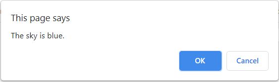
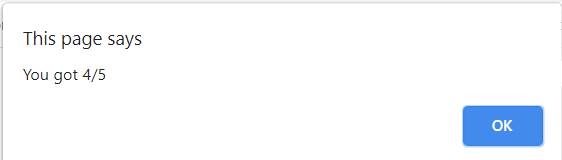

# JS-Quiz-Game

Simple JavaScript Quiz Game

<!-- Live link to deployed app -->

Repository: https://github.com/Mdudzik92/JS-Quiz-Game 
Deployed app: https://mdudzik92.github.io/js-quiz-game/

<!-- Technologies used -->

JavaScript, HTML

<!-- Explanation of what the app is -->

This is a simple quiz game created with inline vanilla JavaScript on a blank HTML file. The user is given alert boxes containing simple true/false questions with OK or Cancel to choose from. If they answer correctly they get an alert that says "Correct!" or if they answer incorrectly they get an alert that says "Wrong!" When they get through them all they are given a score.

<!-- Screenshot -->

<!-- License -->

MIT

<!-- Contact information -->

Email: mdudzik92@gmail.com
